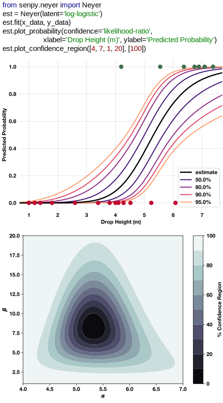

# SenPy
A python package of algorithms for sensitivity testing.
  **Authors:** Alex Casey, David Arthur

Currently implements the Neyer method which consists of:
  - Maximum likelihood estimators (MLEs) to estimate the parameters of an assume latent distribution.
  - Provides a sequential design routine to suggest to the user new stimulus levels for efficent testing.
  
In addition to the functionality provided by the original Neyer software, this code can use an assumed log-logistic distribution and can use the perturbation (delta), parametric bootstrap, and non-parametric boostrap methods to estimate predictive condfidence intervals. 

Basic documentation can be found [here](https://acasey13.github.io/senpy/senpy.html), however, the included manual is the best reference.
  
## Basic Usage
The subdirectory senpy is the python package. Download and add this directory to your current working directory, python site-packages, or to your python path. Then the package can be imported using `import senpy`. Right now all user methods are contained in the Neyer object. So, it is suggested that you use `import senpy.neyer as neyer` and then the Neyer object can be instantiated using `estimator = neyer.Neyer()`.

For example:

## To-do
Future versions will add the following functionality: 
  - Implement the Dror-Steinberg method. (Bayesian approach)
  - Include a Gaussian process classifier with monitonicity constraint.
  - Add ability to evaluate multivariate systems. 
